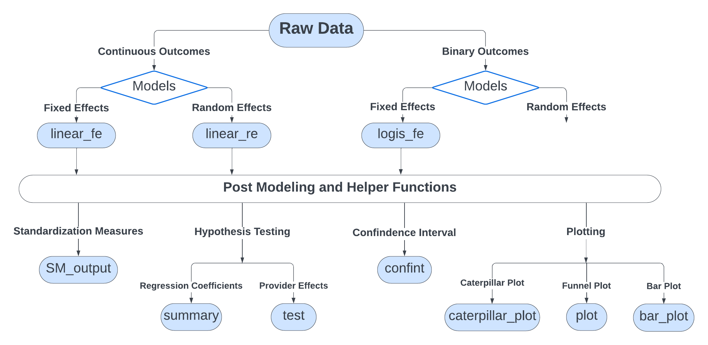

```{r, include = FALSE}
knitr::opts_chunk$set(
  collapse = TRUE,
  comment = "#>"
)
```

<style>
body {
  text-align: justify
}
</style>

## Introduction

The `pprof` software package is designed to provide different risk-adjusted models for data with various types of outcomes, specifically focusing on the field of provider profiling. In addition to model fitting, the package equips a suite of functions for calculating standardized ratios and rates, conducting statistical inference, and generating various plots to aid in the interpretation of results. Currently, the package supports logistic fixed effect models for binary outcomes, as well as linear fixed effect and linear random effect models for continuous outcomes. It is under ongoing development, with plans to incorporate additional models and more robust testing methods.

This tutorial provides a brief overview of the package’s structure and a detailed guide of how to utilize the various functions. Simulated example data (`ExampleDataBinary`) with binary outcomes will be used as an illustration, alongside a real data set with continuous outcomes (`ecls_data`) to demonstrate its application with continuous outcomes. Throughout the tutorial, we will cover the key features and capabilities of `pprof`, presenting examples and use cases to illustrate its functionality comprehensively.

## Installation

```{r ,include=TRUE,eval=FALSE}
require("devtools")
require("remotes")
remotes::install_github("UM-KevinHe/pprof", ref = "main")
```

------------------------------------------------------------------------

## Package Workflow Overview

This section presents the structure and workflow of the `pprof` package. Generally, for datasets with continuous outcomes, either a fixed effect model or a random effect model can be fitted, while for binary outcomes, the current version only supports the fixed effect model. For the calculation of standardized measures, both indirect and direct standardization methods are provided for all models. Regarding hypothesis testing of provider effects, `pprof` includes the flagging based on each provider's performance, categorizing them as 1 (statistically higher), 0 (as expected), or -1 (statistically lower). Confidence intervals are provided for both provider effects and standardized measures. Additionally, various visualizations are equipped to facilitate interpretation of the results. These include caterpillar plots for the confidence intervals of standardized measures, bar plots showing flagging percentages overall and stratified by provider sizes, and funnel plots for indirect standardized measures in fixed effect models. These visualizations offer multiple perspectives for understanding the results effectively.

{width="3000"}

## Model Fitting

`pprof` package introduces three different fitting functions: `logis_fe` for logistic fixed effect model, `linear_fe` for linear fixed effect model, and `linear_re` for linear random effect mode.

The simulated dataset `ExampleDataBinary` is used as an example in this section.

```{r}
library(pprof)
data(ExampleDataBinary)
outcome <- ExampleDataBinary$Y
covar <- ExampleDataBinary$Z
ID <- ExampleDataBinary$ID
data <- data.frame(outcome, covar, ID)
```

Each model function supports three different ways to input data. Users have the flexibility to choose the one that best suits their data availability and convenience. Firstly, users can provide a formula and the whole dataset.

```{r}
formula_fe <- as.formula("outcome ~ id(ID) + z1 + z2 + z3 + z4 + z5")
fit_fe <- logis_fe(formula = formula_fe, data = data, message = F)
```

Additionally, users also input the whole dataset, along with the column names of the outcome vector, the covariate matrix/data frame, and the provider identifier vector.

```{r}
colnames(data)
Y.char <- colnames(data)[1]
Z.char <- colnames(data)[2:6]
ID.char <- colnames(data)[7]
fit_fe <- logis_fe(data = data, Y.char = Y.char, Z.char = Z.char, ID.char = ID.char, message = F)
```

Finally, the function also accepts the outcome vector, the covariate matrix/data frame, and the provider identifier vector.

```{r}
fit_fe <- logis_fe(Y = outcome, Z = covar, ID = ID, message = F)
```

By default, each model fitting function automatically removes all observations containing missing values. If users encounter data-related issues, they can utilize our built-in function `data_check` to perform data quality checks. This function can assist in examining missingness, variation, correlation, and the variance inflation factor (VIF) of variables to ensure data quality before fitting a model.

The logistic fixed effect model provides two algorithmic approaches: the Serial Blockwise Inversion Newton (SerBIN) algorithm (See [Logis FE](https://um-kevinhe.github.io/ppsrr/articles/Logis-FE.html) for more details) and the Block Ascent Newton algorithm. The preferred method can be specified by setting the `method` argument, allowing users to choose the algorithm that best fits their computational needs and model requirements.

## Standardized Measures

Based on the results obtained from the fitted model, users can easily calculate direct or indirect standardized measures as per their specific requirements. The `SM_output` function simply necessitates the users to input the object returned from the model functions and specify the desired type of measure. Additionally, the observed outcomes and "expected" outcomes are included in case users wish to calculate standardized measures under different definitions.

```{r}
SR <- SM_output(fit_fe, stdz = "indirect")
head(SR$indirect.ratio)
head(SR$indirect.rate)
head(SR$OE$OE_indirect)
```

## Hypothesis Testing for Provider Effects

The `test` function is designed to conduct hypothesis testing for provider effects and identify outlier providers. It returns a four-column dataframe, where the "flag" column indicates whether a provider is flagged as an outlier. The other three columns provide the p-values, corresponding test statistics, and the standard errors of provider effects. Users have the flexibility to choose between two-sided and one-sided tests by specifying the `alternative` argument. In cases when the number of providers is very large, outputting all results at once may become cumbersome. To address this, users can opt to display results only for the providers of particular interest by setting the `parm` argument to the corresponding provider ID. This selective output feature makes it easier for users to focus on specific providers without being overwhelmed by extensive data.

```{r}
test(fit_fe, parm = c(16:20, 61:65))
```

## Hypothesis Testing for Covariate Coefficients

Additionally, we offer the `summary` function to provides the test statistics for the covariate coefficients. The output dataframe may include the estimates, standard errors, p-values, and confindence intervals.

```{r}
summary(fit_fe)
```

## Confidence Interval

Both the confidence intervals for provider effects and standardized measures can be obtained from the function `confint` by specifying the value of argument `option`. The function will return a three-column data frame that provides the estimates, along with the corresponding upper and lower bounds of the confidence intervals.

```{r}
confint(fit_fe, parm = c(55:60), option = "gamma")
confint(fit_fe, parm = c(80:85), option = "SM")
```

## Plotting

The caterpillar plot is a type of visualization used to display confidence intervals for estimated parameters, often employed to identify outliers or assess the variability across groups or providers. In `pprof`, the `caterpillar_plot` function is used to generate such plots, providing a clear representation of standardized measures and their associated confidence intervals. To use this function, users need to input a dataframe returned by our built-in `confint` function, with the `option` argument set to "SM" to ensure standardized measures are visualized.

```{r, fig = TRUE, warning = FALSE}
CI_SM <- confint(fit_fe, option = "SM")
caterpillar_plot(CI_SM$CI.indirect_ratio, use_flag = T, errorbar_width = 0.5, errorbar_size = 1)
```

Additionally, a bar plot is also provided to visualize the overall flagging percentage, as well as the percentages stratified by provider sizes. The providers are divided into a specified number of groups, set by the `group_num` argument, where the number of providers is approximately equal across all groups. The flagging percentage for each group is then displayed, giving insights into variations in provider performance. For this plot, users need to input the dataframe returned from the `test` function. This visualization offers an effective way to interpret the performance distribution across different provider groups.

```{r, fig = TRUE, warning = FALSE}
test_df <- test(fit_fe)
bar_plot(test_df, group_num = 4)
```

The current version of `pprof` also supports the funnel plot through the `plot` function, an effective graphical tool for identifying healthcare providers with unusual performance. This function can visualize the indirect standardized differences for the linear fixed effect model and the indirect standardized ratios for the logistic fixed effect model, offering valuable insights into variations in provider performance.

```{r, fig = TRUE, warning = FALSE}
plot(fit_fe, alpha = 0.05)
```

## Real Data Example

### Early Childhood Longitudinal Study (ECLS) Dataset

In this section, we further show the usage of the package by analyzing the Early Childhood Longitudinal Study (ECLS) dataset. We use fifth-grade cross-sectional data, focusing on students' mathematical assessment scores as the continuous outcome, with the continuous predictor household income and the categorical predictor gender. Due to the small number of observations for some schools, we fit the model using all available observations but exclude schools with fewer than five records when generating caterpillat plot and bar plot. This ensures a more reliable and interpretable graphical representation of the results.

```{r}
data(ecls_data)
formula_ecls <- as.formula("Math_Score ~ Income + id(School_ID) + Child_Sex")
fit_ecls <- linear_fe(formula = formula_ecls, data = ecls_data)

obs_counts <- table(ecls_data$School_ID)
schools_with_5_or_more <- as.numeric(names(obs_counts[obs_counts >= 5]))

# Caterpillar Plot
CI_ecls <- confint(fit_ecls, parm = schools_with_5_or_more)
caterpillar_plot(CI_ecls$CI.indirect, use_flag = T)
# Bar Plot
test_ecls <- test(fit_ecls, parm = schools_with_5_or_more)
bar_plot(test_ecls)
# Funnel Plot
plot(fit_ecls, alpha = 0.05)
```
